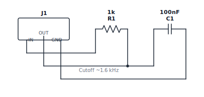
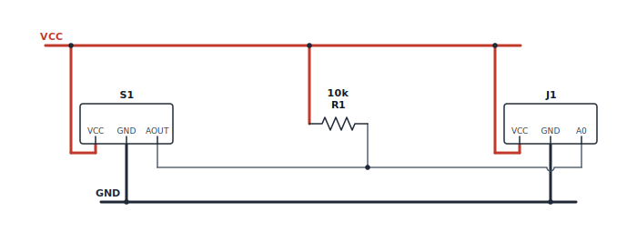
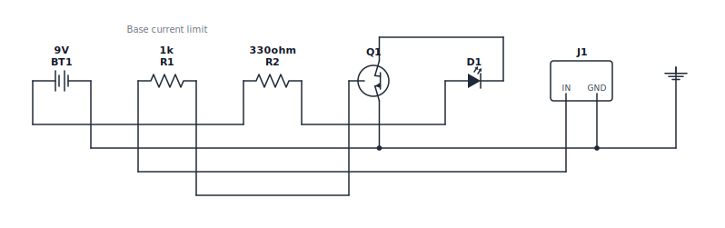

<p align="center">
  <picture>
    <source
      media="(prefers-color-scheme: dark)"
      srcset="./docs/brand/assets/wire-lang-lockup-horizontal-reversed.svg">
    
  </picture>
</p>

<p align="center">
  <a href="https://www.npmjs.com/package/wire-lang"></a>
  <a href="https://www.npmjs.com/package/wire-lang"></a>
  <a href="https://github.com/eduardozf/wire-lang/actions/workflows/ci.yml"></a>
  <a href="./LICENSE"></a>
  
</p>

**Text-first electronic schematics.** Describe a circuit in a small declarative
language and render it as a clean, documentation-ready SVG.

## Why Wire Lang

LLMs changed how we write software because code is text. Diagrams followed with tools like [Mermaid](https://github.com/mermaid-js/mermaid), giving AI a format it can easily generate, understand, and modify.

Electronic schematics are still stuck in GUI editors.

Wire Lang brings schematics into the AI era with a text-based representation that enables real-time collaboration between engineers and AI. Instead of screenshots and proprietary files, schematics become something AI can reason about, generate, review, and improve.

Wire Lang is the missing layer between AI and electronic schematics.

## Setup

```bash
npm install wire-lang
```

Write a `.wire` file:

```wire
schematic
  title "LED current limiting circuit"

  component BT1 Battery voltage=5V
  component R1 Resistor value=220ohm
  component D1 LED color=red

  net VCC: BT1.+, R1.1
  connect R1.2, D1.A
  net GND: D1.C, BT1.-

  annotation "Current limiting resistor" near R1
```

Render it from the CLI:

```bash
npx wire render led.wire --out led.svg
```

…or from JavaScript/TypeScript:

```ts
import { renderSvg } from "wire-lang";

const svg = renderSvg(source);
```

## How it compares

Think **[Mermaid Charts](https://github.com/mermaid-js/mermaid), but for electronic schematics**: text goes in, documentation-
friendly diagrams come out. The difference is that Wire Lang models real
electrical nets, terminals, and components instead of flowchart boxes and arrows.

## Use with AI

Wire Lang is built for AI-assisted authoring:

- `parse(source)` returns a partial AST even for invalid input, and every
  diagnostic carries a source location and suggested fix — so agents can
  self-correct.
- The CLI speaks JSON for scripts and agents: `wire check led.wire --json`.
- A bundled [Agent Skill](./skills/wire-lang/SKILL.md) teaches assistants the
  syntax and component library so they generate valid `.wire` source.

Install the authoring skill with the open Agent Skills CLI:

```bash
npx skills add eduardozf/wire-lang --skill wire-lang
```

## Examples

| RC filter                                                                                          | Soil sensor module                                                                                  | NPN LED driver                                                                                      |
| -------------------------------------------------------------------------------------------------- | --------------------------------------------------------------------------------------------------- | --------------------------------------------------------------------------------------------------- |
|  |  |  |

See the [full gallery](./docs/EXAMPLES.md) and source in [examples/](./examples).

---

## Reference

### The language

Wire Lang separates the electrical model from the rendered drawing. In the
source below, `R1`/`D1` are component instances, `Resistor`/`LED` are types,
`VCC`/`GND` are nets, and `connect` makes an anonymous net. Visual wires are
renderer output, not the source of truth.

```wire
schematic
  component R1 Resistor value=10k
  component D1 LED color=red

  net VCC: R1.1
  connect R1.2, D1.A
  net GND: D1.C
```

Components can also be defined locally, including overriding a built-in symbol:

```wire
define component SoilSensor
  terminal VCC
  terminal GND
  terminal AOUT
  terminal DOUT
  symbol module
end

component S1 SoilSensor
```

### API

```ts
import { compile, parse, renderSvg } from "wire-lang";

const parsed = parse(source); // public AST, or partial AST + diagnostics
const model = compile(source); // renderer-independent schematic model
const svg = renderSvg(source); // SVG string, or throws WireLangError
```

`parse` / `compile` accept source; `compile` / `renderSvg` also accept the prior
stage's output. Packages are ESM-only and target Node.js 20+.

### CLI

```bash
wire check  examples/led.wire            # validate
wire render examples/led.wire --out led.svg
wire watch  examples/led.wire --out led.svg
```

Add `--json` to `check`/`render` for machine-readable output. Exit codes: `0`
success (incl. warnings), `1` source/render errors, `2` usage or I/O problems.
There is no preview server; open the generated SVG directly.

### Standard components

`Resistor`, `Capacitor`, `PolarizedCapacitor`, `Inductor`, `Diode`, `LED`,
`NPNTransistor`, `PNPTransistor`, `Battery`, `GroundReference`, `SPSTSwitch`,
`PushButton`, `Header`.

Wire Lang uses IEC-style conventions where practical with original, open-source
symbol art; it does not claim formal IEC/IEEE compliance. See
[CONTRIBUTING.md](./.github/CONTRIBUTING.md) for the artwork policy.

### Packages & development

| Package                              | Role                                                       |
| ------------------------------------ | ---------------------------------------------------------- |
| [`wire-lang`](./packages/wire-lang)  | User-facing aggregate package and the `wire` binary        |
| [`@wire-lang/core`](./packages/core) | Parser, compiler, schematic model, layout engine, renderer |
| [`@wire-lang/cli`](./packages/cli)   | `wire check`, `wire render`, `wire watch`                  |

```bash
pnpm install
pnpm build   # tsup build + tsc typecheck
pnpm test    # vitest
```

### Scope

The MVP is implemented: a working `parse → compile → layout → renderSvg`
pipeline plus the CLI. Scope is intentionally narrow — schematic documentation,
not simulation, PCB/breadboard layout, BOMs, or editor integrations. See
[docs/MVP.md](./docs/MVP.md) for the full specification.

## Documentation

- [MVP specification](./docs/MVP.md) · [Example gallery](./docs/EXAMPLES.md) · [Domain vocabulary](./docs/CONTEXT.md)
- [Architecture decisions](./docs/adr/) · [Brand assets](./docs/brand/)
- [Contributing](./.github/CONTRIBUTING.md) · [Code of conduct](./.github/CODE_OF_CONDUCT.md) · [Support](./.github/SUPPORT.md) · [Security](./.github/SECURITY.md) · [Changelog](./CHANGELOG.md)

## Contributing

Wire Lang is early and design-heavy. The most useful contributions right now are
tightening the language spec, challenging ambiguous syntax, proposing test cases
for parsing and layout stability, and designing original schematic symbols. Read
[CONTRIBUTING.md](./.github/CONTRIBUTING.md) first.

## License

[MIT](./LICENSE).
