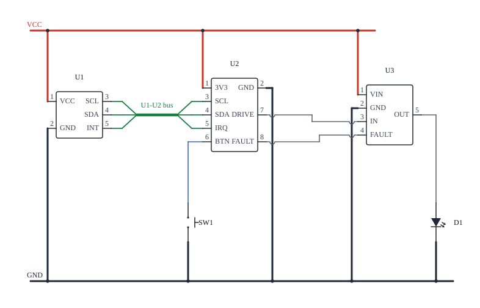

<p align="center">
  <picture>
    <source
      media="(prefers-color-scheme: dark)"
      srcset="./docs/brand/assets/wire-lang-lockup-horizontal-reversed.svg">
    
  </picture>
</p>

<p align="center">
  <a href="https://www.npmjs.com/package/wire-lang"></a>
  <a href="https://www.npmjs.com/package/wire-lang"></a>
  <a href="https://github.com/eduardozf/wire-lang/actions/workflows/ci.yml"></a>
  <a href="./LICENSE"></a>
  
</p>

Describe electronic schematics in text and render them as SVG.

## This is how you write

Name the components, declare their pins, and connect them with nets.
Here is an excerpt from a sensor controller with a button and status LED:

```wire
schematic
  title "Sensor controller with status LED"

  // Declare a button and a green status LED.
  component SW1 PushButton
  component D1 LED color=green

  // Connect named pins to describe each electrical net.
  net BTN: SW1.1, U2.BTN
  net LED_OUT: U3.OUT, D1.A
  // ... full circuit below
```

<details>
<summary>View the complete Wire Lang source</summary>

```wire
schematic
  title "Sensor controller with status LED"
  description "A controller reads an I2C sensor, accepts a button input, and controls a status LED through a driver."

  // Declare each block and its named pins. @left and @right set pin sides.
  // U1: I2C sensor with an interrupt output.
  component U1 IC pins=[1:VCC@left, 2:GND@left, 3:SCL@right, 4:SDA@right, 5:INT@right]
  // U2: microcontroller that reads the sensor and button.
  component U2 IC pins=[1:3V3@left, 2:GND@right, 3:SCL@left, 4:SDA@left, 5:IRQ@left, 6:BTN@left, 7:DRIVE@right, 8:FAULT@right]
  // U3: LED driver with a fault output back to the controller.
  component U3 IC pins=[1:VIN@left, 2:GND@left, 3:IN@left, 4:FAULT@left, 5:OUT@right]
  component SW1 PushButton
  component D1 LED color=green

  // All blocks share the supply and ground rails.
  net VCC: U1.VCC, U2.3V3, U3.VIN
  net GND: U1.GND, U2.GND, U3.GND, SW1.2, D1.C

  // The sensor sends readings over I2C and signals an interrupt on INT.
  net SCL: U1.SCL, U2.SCL
  net SDA: U1.SDA, U2.SDA
  net INT: U1.INT, U2.IRQ

  // The controller commands the driver, which reports faults back.
  net DRIVE: U2.DRIVE, U3.IN
  net FAULT: U3.FAULT, U2.FAULT

  // Pressing the button connects BTN to ground. The driver powers the LED.
  net BTN: SW1.1, U2.BTN
  net LED_OUT: U3.OUT, D1.A

  // Draw supply rails above and below the blocks, and bundle related signals.
  render layout=bus-rail
```

</details>

## This is what you get

The complete source renders as a schematic with shared power rails, a sensor
bus, and separate control signals.



## jsDelivr CDN

Add this module script to your site's `<head>`. It waits for the page to load,
then renders every Wire Lang code block:

```html
<script type="module">
  import wire from "https://cdn.jsdelivr.net/npm/@wire-lang/browser/dist/index.js";

  await wire.initialize();
</script>
```

The versionless URL loads the latest version published on npm and will follow
future releases.

<details>
<summary>Show all CDN URLs</summary>

| Package | CDN URL |
| --- | --- |
| `wire-lang` | <https://cdn.jsdelivr.net/npm/wire-lang> |
| `@wire-lang/core` | <https://cdn.jsdelivr.net/npm/@wire-lang/core> |
| `@wire-lang/cli` | <https://cdn.jsdelivr.net/npm/@wire-lang/cli> |
| `@wire-lang/browser` | <https://cdn.jsdelivr.net/npm/@wire-lang/browser> |
| `@wire-lang/markdown` | <https://cdn.jsdelivr.net/npm/@wire-lang/markdown> |

</details>

## Install and use

```bash
npm install wire-lang
```

Save the [complete source](./examples/sensor-controller.wire) as
`sensor-controller.wire`, then render it:

```bash
npx wire render sensor-controller.wire --out sensor-controller.svg
```

Open `sensor-controller.svg` to view the schematic. To render from JavaScript or TypeScript:

```ts
import { renderSvg } from "wire-lang";

const svg = renderSvg(source);
```

## AI skill

Install the [Wire Lang authoring skill](./skills/wire-lang/SKILL.md) to teach your
AI assistant the syntax, component library, and validation workflow:

```bash
npx skills add eduardozf/wire-lang --skill wire-lang
```

Agents can validate source with `wire check sensor-controller.wire --json`. The parser returns
a partial AST for invalid input, with source locations and suggested fixes in
its diagnostics.

## Markdown and MDX

Write the same source inside a Markdown or MDX fence:

````markdown
```wire
schematic
  component R1 Resistor value=220ohm
  component D1 LED color=red
  connect R1.1, D1.A
```
````

```bash
npm install @wire-lang/browser
```

Initialize the renderer in your site's browser entry point:

```js
import wire from "@wire-lang/browser";

const { errors } = await wire.initialize();
for (const { error } of errors) console.error(error);
```

The default workflow renders diagrams asynchronously after HTML is ready.
Your Markdown processor must preserve `pre > code.language-wire` blocks. See
the [browser guide](./packages/browser) for setup and client navigation.

For ahead-of-time rendering with no browser runtime, use `remarkWire` or
`rehypeWire` from `@wire-lang/markdown` with `{ mode: "static" }`. See the
[Markdown/MDX guide](./packages/markdown) for complete build configuration.

## Reference

### API

```ts
import { compile, parse, renderSvg } from "wire-lang";

const parsed = parse(source); // public AST, or partial AST + diagnostics
const model = compile(source); // renderer-independent schematic model
const svg = renderSvg(source); // SVG string, or throws WireLangError
```

`parse` / `compile` accept source; `compile` / `renderSvg` also accept the prior
stage's output. Packages are ESM-only and target Node.js 20+.

### CLI

```bash
wire check  examples/sensor-controller.wire            # validate
wire render examples/sensor-controller.wire --out sensor-controller.svg
wire watch  examples/sensor-controller.wire --out sensor-controller.svg
```

Add `--json` to `check`/`render` for machine-readable output. Exit codes: `0`
success (incl. warnings), `1` source/render errors, `2` usage or I/O problems.
There is no preview server; open the generated SVG directly.

## Contributing

Wire Lang is early and design-heavy. The most useful contributions right now are
tightening the language spec, challenging ambiguous syntax, proposing test cases
for parsing and layout stability, and designing original schematic symbols. Read
[CONTRIBUTING.md](./.github/CONTRIBUTING.md) first.

## License

[MIT](./LICENSE).
