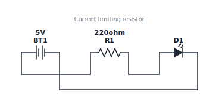
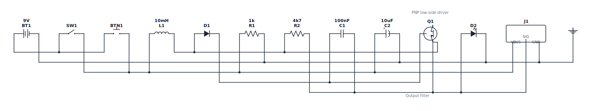
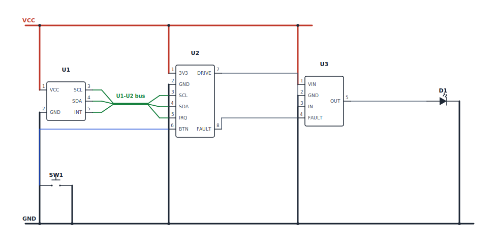
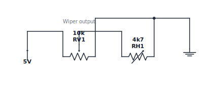
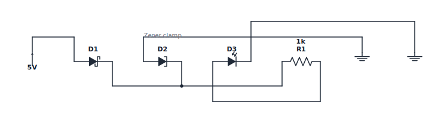

# Example Gallery

These images are generated from the `.wire` files in [examples/](../examples)
using Wire Lang's own renderer. They are useful for README previews, launch
posts, and regression-checking the current visual style.

The MVP renderer is deterministic, but layout is still intentionally modest.
Some routing and label placement will improve in later releases.

Regenerate this gallery with:

```sh
pnpm examples:update
```

## LED Current Limiter

Source: [examples/led.wire](../examples/led.wire)



## RC Low-Pass Filter

Source: [examples/rc-filter.wire](../examples/rc-filter.wire)


## Soil Sensor Input

Source: [examples/soil-sensor.wire](../examples/soil-sensor.wire)


## NPN LED Driver

Source: [examples/npn-led-driver.wire](../examples/npn-led-driver.wire)


## Standard Symbol Coverage

Source: [examples/kitchen-sink.wire](../examples/kitchen-sink.wire)



## Bus-Rail Layout

Source: [examples/bus-rail.wire](../examples/bus-rail.wire)



## Potentiometer Voltage Divider

Source: [examples/pot-divider.wire](../examples/pot-divider.wire)



## Diode Variants

Source: [examples/diode-variants.wire](../examples/diode-variants.wire)


