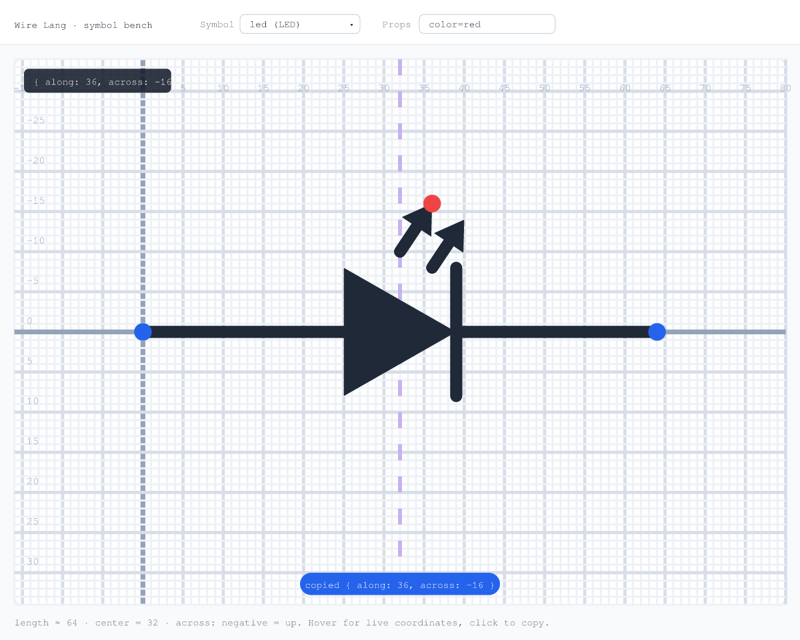

# Symbol bench

A dev-only tool for designing the schematic glyphs in
`packages/core/src/render/symbols.ts`. It renders one symbol large on a labeled
`along`/`across` grid and shows the live coordinate under your cursor, so placing
something like the LED emission arrows is a glance-and-hover instead of
edit-rebuild-squint.

It imports the real renderer (`@wire-lang/core`), so what you see is exactly what
ships. It is not part of any package build and is never published.



> The image above is a faithful reference rendered through the bench's own
> pipeline (no headless browser was available to capture the live page); the
> running tool looks the same.

## Usage

```sh
pnpm bench
```

Then open http://localhost:4321 and pick a symbol.

- **Hover** the grid to read the live `{ along, across }` at the cursor.
- **Click** to copy that coordinate to the clipboard.
- Edit the symbol in `packages/core/src/render/symbols.ts` and **save** — the tool
  rebuilds core and the page auto-refreshes.

The edit loop: hover to find where you want a point → type that `{ along, across }`
into the symbol recipe → watch it update live.

Notes:
- `pnpm bench --no-watch` just serves (build core yourself with
  `pnpm --filter @wire-lang/core run build:js`).
- `PORT=xxxx pnpm bench` to change the port.
- Two-terminal symbols (resistor, LED, capacitor, …) get the `along`/`across`
  grid. The transistor/module/ground use a plain x/y grid, since their geometry
  isn't axis-based.
```
